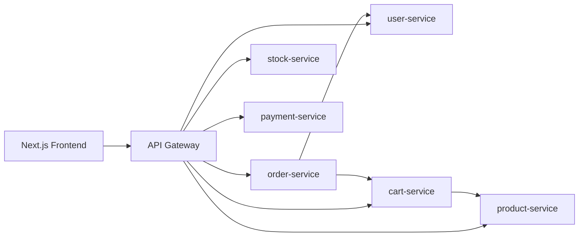
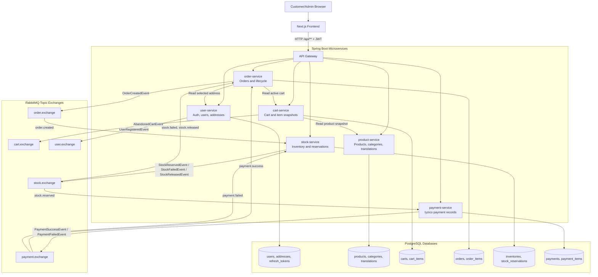
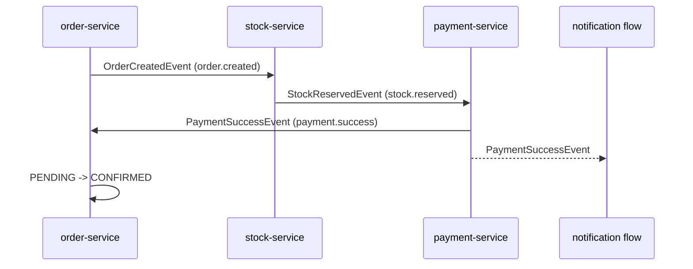
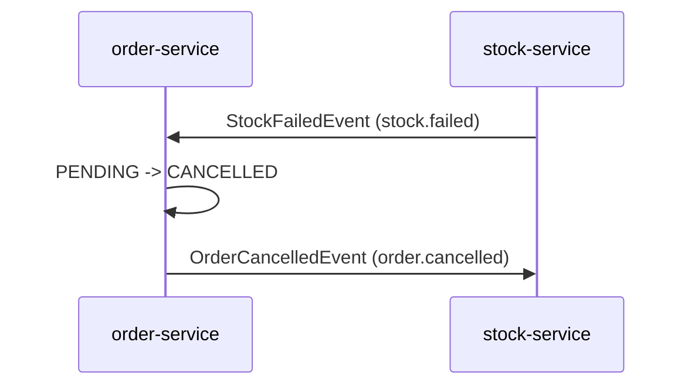
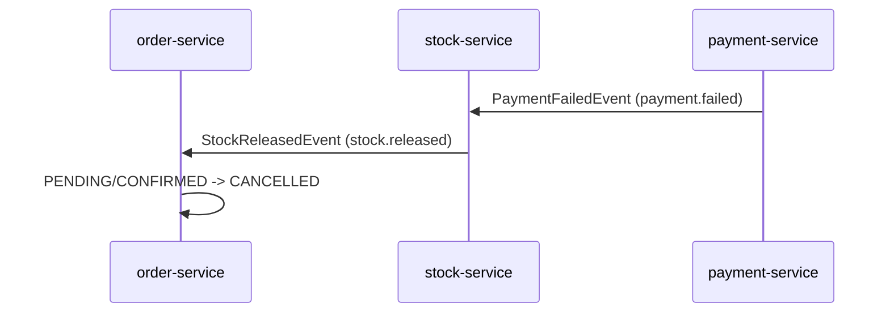

# N11 E-Commerce Microservices

Bu repo, bootcamp kapsamında geliştirilen e-ticaret projesinin backend servislerini ve deployment dosyalarını içerir. Sistem; Spring Boot mikroservisleri, RabbitMQ üzerinden choreography tabanlı SAGA akışı, PostgreSQL, merkezi config yönetimi ve public giriş noktası olarak API Gateway üzerine kuruludur.

Frontend uygulaması `n11-ecommerce-fe` klasöründedir. Browser tarafı backend servislerine doğrudan değil, API Gateway üzerinden gider.

## Servis Haritası

| Servis | Port | Sorumluluk | Erişim |
| --- | ---: | --- | --- |
| `api-gateway` | 8080 | Public routing, auth sınırı, Swagger toplama | Public |
| `user-service` | 8081 | Signup, signin, JWT, refresh token, kullanıcı, adres | Gateway üzerinden |
| `product-service` | 8082 | Kategori, ürün, lokalize katalog içeriği | Gateway üzerinden |
| `cart-service` | 8083 | Aktif sepet, ürün snapshotları, terk edilmiş sepet eventi | Gateway üzerinden |
| `order-service` | 8084 | Sipariş oluşturma, adres snapshotı, sipariş yaşam döngüsü | Gateway üzerinden |
| `stock-service` | 8085 | Inventory ve stock reservation | Gateway üzerinden, admin ağırlıklı |
| `payment-service` | 8086 | Iyzico sandbox ödeme kayıtları ve SAGA payment adımı | Gateway üzerinden |
| `config-server` | 8762 | Merkezi konfigürasyon | Internal/dev |
| `discover-server` | 8761 | Eureka servis keşfi | Internal/dev |

Destek servisleri:

| Bileşen | Port | Amaç |
| --- | ---: | --- |
| RabbitMQ | 5672, 15672 | Event bus ve management UI |
| Prometheus | 9090 | Metrics scraping |
| Grafana | 3000 | Dashboard |
| Loki | 3100 | Structured log toplama |

## Genel İstek Akışı



Frontend bütün backend çağrılarını API Gateway'e yapar. Gateway, servisleri Eureka üzerinden logical service name ile bulur. Customer ve admin ekranları aynı gateway'i kullanır; erişim JWT role claim'leri ve servislerdeki `@PreAuthorize` kurallarıyla ayrılır.

## Sistem UML

Bu diyagram, kullanıcının checkout isteğinden başlayıp servisler arası senkron çağrıları ve RabbitMQ üzerinden ilerleyen SAGA eventlerini birlikte gösterir.



## Authentication

Kullanıcıya özel veya yazma işlemi yapan endpointlerde genellikle şu header gerekir:

```http
Authorization: Bearer <access-token>
```

Katalog okuma endpointleri publictir. Admin endpointleri `ADMIN` rolü ister. Signup her zaman `CUSTOMER` oluşturur; admin kullanıcıların DB veya kontrollü bir admin süreciyle oluşturulması hedeflenmiştir.

Temel auth endpointleri:

| Method | Path | Açıklama |
| --- | --- | --- |
| `POST` | `/api/auth/signup` | Customer hesabı oluşturur |
| `POST` | `/api/auth/signin` | Access token ve refresh token döner |
| `POST` | `/api/auth/refresh` | Yeni access token üretir |
| `POST` | `/api/auth/logout` | `X-User-Id` ile refresh token'ı revoke eder |

## Katalog Lokalizasyonu

Ürün ve kategori okuma endpointleri şu header ile lokalize cevap dönebilir:

```http
Accept-Language: tr
Accept-Language: en
```

Lokalize metinler translation tablolarında tutulur. İstenen dil için çeviri yoksa servis default ürün/kategori alanlarına düşer.

## SAGA Choreography

RabbitMQ event bus olarak kullanılır. Ayrı bir orchestrator servis yoktur. Her servis kendi eventini dinler, kendi işini yapar ve sonraki event'i yayınlar.

Happy path:



Stock failure:



Payment failure:



Event isimleri:

| Exchange | Routing key | Ana consumer |
| --- | --- | --- |
| `order.exchange` | `order.created` | `stock-service` |
| `order.exchange` | `order.cancelled` | `stock-service`, notification flow |
| `stock.exchange` | `stock.reserved` | `payment-service` |
| `stock.exchange` | `stock.failed` | `order-service` |
| `stock.exchange` | `stock.released` | `order-service` |
| `payment.exchange` | `payment.success` | `order-service`, notification flow |
| `payment.exchange` | `payment.failed` | `stock-service`, notification flow |
| `cart.exchange` | `abandoned.cart` | notification flow |
| `user.exchange` | `user.registered` | notification flow |

## Ana Tablolar

| Servis | Tablolar |
| --- | --- |
| `user-service` | `users`, `addresses`, `refresh_tokens` |
| `product-service` | `categories`, `category_translations`, `products`, `product_translations` |
| `cart-service` | `carts`, `cart_items` |
| `order-service` | `orders`, `order_items` |
| `stock-service` | `inventories`, `stock_reservations` |
| `payment-service` | `payments`, `payment_items` |

Sepet, sipariş ve ödeme kayıtlarında ürün adı, fiyat, görsel ve teslimat adresi gibi alanların snapshotı tutulur. Böylece katalog veya adres sonradan değişse bile geçmiş siparişlerin anlamı bozulmaz.

## Entity Relationship Diagram

Bu ERD, servislerin kendi veritabanı sahipliğini koruyacak şekilde çizilmiştir. Aynı servis içindeki ilişkiler fiziksel foreign key olarak modellenir; servisler arası çizgiler ise `user_id`, `product_id` ve `order_id` gibi logical reference alanlarını gösterir.

```mermaid
erDiagram
  USERS {
    string id PK
    string username UK
    string email UK
    string password
    string role
    string first_name
    string last_name
    string phone_number
    boolean active
    datetime created_at
    datetime updated_at
  }

  ADDRESSES {
    string id PK
    string user_id FK
    string title
    string street
    string city
    string country
    string zip_code
    boolean is_default
    datetime created_at
    datetime updated_at
  }

  REFRESH_TOKENS {
    string id PK
    string token UK
    string user_id FK
    datetime expiry_date
    datetime created_at
    boolean revoked
  }

  CATEGORIES {
    bigint id PK
    string name UK
    string slug UK
    string description
    datetime created_at
    datetime updated_at
  }

  CATEGORY_TRANSLATIONS {
    bigint id PK
    bigint category_id FK
    string locale
    string name
    string description
  }

  PRODUCTS {
    bigint id PK
    bigint category_id FK
    string name
    string slug UK
    text description
    decimal price
    string image_url
    boolean active
    datetime created_at
    datetime updated_at
  }

  PRODUCT_TRANSLATIONS {
    bigint id PK
    bigint product_id FK
    string locale
    string name
    text description
    text search_text
  }

  CARTS {
    bigint id PK
    string user_id REF
    string status
    datetime last_activity_at
    datetime created_at
    datetime updated_at
  }

  CART_ITEMS {
    bigint id PK
    bigint cart_id FK
    bigint product_id REF
    string product_name_snapshot
    string product_image_url_snapshot
    decimal unit_price_snapshot
    int quantity
  }

  ORDERS {
    bigint id PK
    string order_number UK
    string user_id REF
    string status
    decimal total_price
    string payment_method
    string status_reason
    string shipping_source_address_id REF
    string shipping_title
    string shipping_street
    string shipping_city
    string shipping_country
    string shipping_zip_code
    datetime created_at
    datetime updated_at
  }

  ORDER_ITEMS {
    bigint id PK
    bigint order_id FK
    bigint product_id REF
    string product_name_snapshot
    string product_image_url_snapshot
    decimal unit_price_snapshot
    int quantity
    decimal line_total
  }

  INVENTORIES {
    bigint id PK
    bigint product_id REF
    int available_quantity
    int reserved_quantity
    bigint version
    datetime created_at
    datetime updated_at
  }

  STOCK_RESERVATIONS {
    bigint id PK
    bigint order_id REF
    string order_number
    string user_id REF
    bigint product_id REF
    string product_name
    int quantity
    string status
    datetime created_at
    datetime updated_at
  }

  PAYMENTS {
    bigint id PK
    bigint order_id REF
    string order_number
    string user_id REF
    string conversation_id
    string iyzico_payment_id
    string status
    decimal price
    decimal paid_price
    string currency
    string iyzico_status
    string failure_reason
    datetime created_at
    datetime updated_at
  }

  PAYMENT_ITEMS {
    bigint id PK
    bigint payment_id FK
    bigint product_id REF
    string product_name
    int quantity
    decimal unit_price
    decimal line_total
  }

  USERS ||--o{ ADDRESSES : owns
  USERS ||--o| REFRESH_TOKENS : has
  CATEGORIES ||--o{ PRODUCTS : contains
  CATEGORIES ||--o{ CATEGORY_TRANSLATIONS : localizes
  PRODUCTS ||--o{ PRODUCT_TRANSLATIONS : localizes
  CARTS ||--o{ CART_ITEMS : contains
  ORDERS ||--o{ ORDER_ITEMS : contains
  PAYMENTS ||--o{ PAYMENT_ITEMS : contains

  USERS ||--o{ CARTS : logical_user_id
  USERS ||--o{ ORDERS : logical_user_id
  USERS ||--o{ STOCK_RESERVATIONS : logical_user_id
  USERS ||--o{ PAYMENTS : logical_user_id
  ADDRESSES ||--o{ ORDERS : shipping_snapshot
  PRODUCTS ||--o{ CART_ITEMS : product_snapshot
  PRODUCTS ||--o{ ORDER_ITEMS : product_snapshot
  PRODUCTS ||--o| INVENTORIES : stocked_as
  PRODUCTS ||--o{ STOCK_RESERVATIONS : reserves
  PRODUCTS ||--o{ PAYMENT_ITEMS : payment_snapshot
  ORDERS ||--o{ STOCK_RESERVATIONS : saga_reservation
  ORDERS ||--o| PAYMENTS : paid_by
```

## Local Çalıştırma Sırası

Önce ortak bağımlılıkları kaldır:

```bash
docker compose up -d rabbitmq prometheus loki grafana
```

IDE veya Maven ile servisleri şu sırada başlatmak en sorunsuz akıştır:

1. `discover-server`
2. `config-server`
3. `api-gateway`
4. İhtiyaca göre domain servisleri: `user-service`, `product-service`, `cart-service`, `order-service`, `stock-service`, `payment-service`

Local profile için temel değerler:

```text
CONFIG_URI=http://localhost:8762
SPRING_PROFILES_ACTIVE=local
```

## Production Deploy

Image'lar GitHub Actions içinde Jib ile build edilir ve DockerHub'a pushlanır. CD pipeline EC2'ye bağlanır, environment ve compose dosyalarını taşır, image'ları çeker, önce infrastructure/config katmanını başlatır, sonra application servislerini ayağa kaldırır.

Runtime URL'leri:

| Ortam | Frontend | API Gateway | Swagger UI |
| --- | --- | --- | --- |
| Local | `http://localhost:4000` | `http://localhost:8080` | `http://localhost:8080/swagger-ui/index.html` |
| Production | `https://n11market-berklimoncu.vercel.app` | `http://54.229.67.8:8080` | `http://54.229.67.8:8080/swagger-ui/index.html` |

Production secrets GitHub Actions veya EC2 `.env.production` üzerinden yönetilir. DB, JWT, RabbitMQ, DockerHub, EC2 SSH, Iyzico ve mail gibi değerler servis YAML dosyalarına hardcode edilmemelidir.

## CI/CD ve Deployment Notu

Backend CI/CD GitHub Actions ile yönetilir. Backend reposunda iki ana branch akışı vardır: geliştirme `develop` branch'inde yapılır, production deploy ise `main` branch'ine merge edildiğinde başlar. `develop` veya `feature/**` branch'lerine push atıldığında CI pipeline tetiklenir. İlk adım commit mesajı formatını kontrol eder; commit mesajının `vX.Y.Z ...` formatıyla başlaması gerekir. Örneğin `v1.0.0 feat(order-service): add SAGA logic` geçerli, versiyon prefix'i olmayan bir commit geçersizdir. Sonrasında Java 21 kurulur, Maven cache kullanılır ve repo kökündeki `*-server`, `*-service`, `*-gateway` modülleri sırayla build edilir.

Backend deploy için geliştirici `develop` branch'inden `main` branch'ine pull request açar ve merge eder. `main` branch'ine push geldiğinde CD pipeline çalışır. Pipeline; `discover-server`, `config-server`, `api-gateway`, `user-service`, `product-service`, `cart-service`, `order-service`, `stock-service` ve `payment-service` image'larını Jib ile Dockerfile kullanmadan üretir ve DockerHub'a pushlar. DockerHub kullanıcı adı ve token bilgisi GitHub Secrets üzerinden alınır.

CD pipeline production environment dosyasını GitHub Secrets ve Variables değerlerinden render eder. DB connection bilgileri, JWT secret, RabbitMQ bilgileri, Iyzico sandbox key'leri, seed flag'leri ve Grafana ayarları burada toplanır. Pipeline özellikle `DB_URL` değerinin `jdbc:` ile başladığını kontrol eder; bu küçük kontrol RDS bağlantı hatalarını deploy öncesinde yakalamak için eklenmiştir. Üretilen `.env.production`, `docker-compose.yml` ve `prometheus.yml` dosyaları SSH/SCP ile EC2 üzerindeki `~/ecommerce` dizinine taşınır.

EC2 deploy adımı uzaktaki makinede DockerHub'a login olur, güncel image'ları çeker ve servisleri kontrollü sırayla başlatır. Önce infrastructure ve platform katmanı ayağa kalkar: RabbitMQ, Loki, Prometheus, Grafana, discovery-server ve config-server. Config Server health check geçmeden application servisleri başlatılmaz. Ardından tüm servisler Docker Compose ile ayağa kaldırılır, API Gateway health check beklenir ve son olarak user, product, cart, order, stock ve payment servislerinin Eureka'ya register olduğu doğrulanır. Bu kontrollerden biri başarısız olursa pipeline ilgili container loglarını basar ve deploy'u fail eder.

CI ve CD sonuçları Slack'e webhook üzerinden bildirilir. CI başarılıysa branch ve commit mesajını içeren success mesajı, başarısızsa failure mesajı gelir. CD tarafında da EC2 deploy başarılı olduğunda Slack'e deploy bildirimi düşer; hata durumunda aynı kanalda deploy failure mesajı görünür. Böylece GitHub Actions ekranına girmeden build/deploy durumu takip edilebilir.

Frontend tarafında CI yine GitHub Actions ile çalışır. Frontend projesinde commit mesajı formatı aynı şekilde kontrol edilir, Node.js 20 kurulur, `npm ci` ile bağımlılıklar yüklenir ve `npm run build` çalıştırılır. Frontend production deployment ise Vercel entegrasyonu ile yönetilir. `develop` branch'inde geliştirme yapılır; `develop` -> `main` merge sonrası Vercel'in kendi CD pipeline'ı production build ve deploy sürecini tetikler. Frontend CI sonucu da Slack webhook ile başarılı/başarısız olarak bildirilir.

AWS tarafında veritabanı RDS PostgreSQL üzerindedir. Uygulama servisleri Elastic Beanstalk yerine EC2 üzerinde Docker Compose ile çalıştırılır. Bu seçim, birden fazla mikroservisi, RabbitMQ'yu ve observability containerlarını tek makinede daha açık kontrol edebilmek için yapılmıştır. Elastic Beanstalk alternatifi mümkün olsa da bu projede compose tabanlı servis sırası, environment dosyası ve health check akışı daha doğrudan yönetilir.

Frontend, backend servislerine doğrudan browser içinden gitmez; Next.js tarafında BFF benzeri bir katman kullanır. Form mutation'ları Server Actions üzerinden çalışır, `backendFetch` backend isteklerini server-side olarak API Gateway'e gönderir ve JWT değerleri httpOnly cookie içinde tutulur. Bu nedenle son kullanıcının browser Network tabında access token ile yapılan doğrudan servis çağrıları görünmez; browser daha çok Next.js sayfa/action akışını görür. Bu yapı hem token sızıntısı riskini azaltır hem de backend URL, auth header ve dil header'ı gibi detayları frontend server katmanında merkezileştirir.

## Swagger ve Health

Gateway Swagger UI:

```text
http://localhost:8080/swagger-ui/index.html
```

Health endpoint:

```text
http://localhost:8080/actuator/health
```

Her Spring servisi Prometheus için `/actuator/prometheus` endpointini de expose eder.
